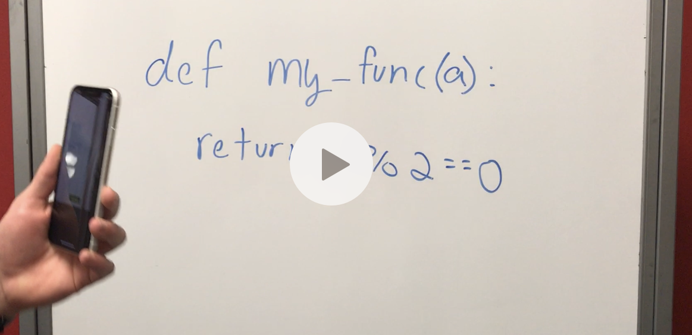

# Mobile Apps for Sensing & Learning
### By Jake Carlson and Eric Smith

Labs for CSE7323: Mobile Apps for Sensing & Learning
## Final Project - CoreML, ARKit, and SwiftOCR
Our final project turns whiteboard code into the real thing! Utilizing SwiftOCR, we parse and interpret Python code as it's written on a board. That code is then sent to a server where a Docker container is created and the code is evaluated. The result is then showed to the user in real time.

[](https://r3---sn-q4flrney.c.drive.google.com/videoplayback?id=58aef9e73198a8f4&itag=22&source=webdrive&requiressl=yes&pl=20&sc=yes&ttl=transient&ei=IiGAXOyiMI_8uAXV0rboAQ&susc=dr&driveid=1YRP63IhlidJ9vhAnSH7DoSAykj-ykLhO&app=texmex&mime=video/mp4&dur=72.283&lmt=1544736616394199&ip=209.58.150.75&ipbits=0&expire=1551915362&cp=QVNKU0pfVFNUQ1hOOjNyQjV0b0pVM3B0&sparams=app,cp,driveid,dur,ei,expire,id,ip,ipbits,itag,lmt,mime,mm,mn,ms,mv,pl,requiressl,sc,source,susc,ttl&signature=7AF61DE024D06982BE6948CF4952F2D95ADBD1A1.58A97DBEB957B529A755E2907050F91539384A2E&key=cms1&cpn=BX44ijxJfp6opFV1&c=WEB_EMBEDDED_PLAYER&cver=20190305&redirect_counter=1&cm2rm=sn-q4fk77e&fexp=23773188&req_id=8bd41b939e2fa3ee&cms_redirect=yes&mm=34&mn=sn-q4flrney&ms=ltu&mt=1551900864&mv=m)

## Lab 4 - OpenCV and Camera
This lab is a little weird - we made use of the iPhone's cameras to do some fun things. The first half of the app is able to detect a face, determine which eyes someone has open, and even tell if the person is smiling! The other part of the app uses the phone's camera to measure heart rate. Just put your finger over the rear camera, and your HR is graphed live on the screen.

## Lab 3 - Core Motion and SpriteKit
This app tracks your walking in the background and rewards you with a game! If you pass your step goal for the day, you get to play Asteroid Dodge: a game where you guide a spaceship through an asteroid field.

## Lab 2 - Audio Filtering, the FFT, and Doppler Shifts
In this lab, we use a fast Fourier transform to calculate the frequencies of highest magnitude being picked up by the iPhone's microphone. We also make use of Doppler shifts to determine if someone is moving their hand towards or away from the microphone. 

## Lab 1 - BuildMe
This app helps users track their workout progress.

